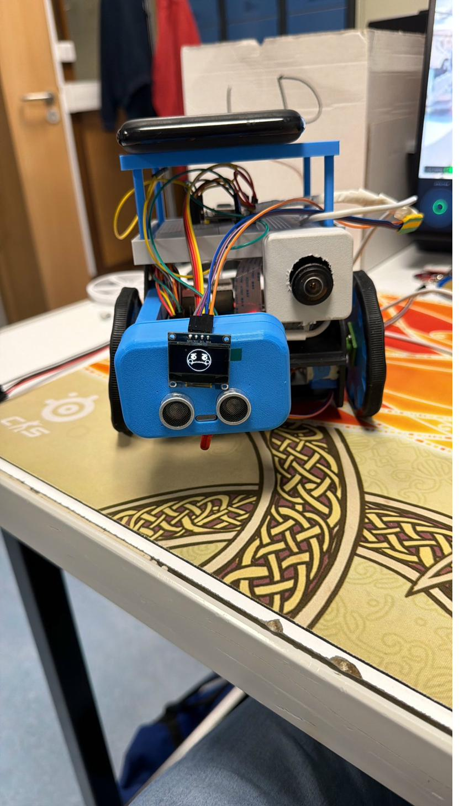
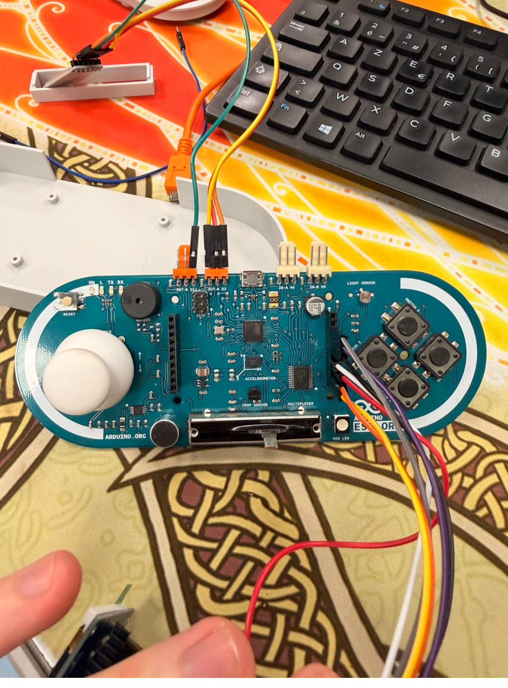
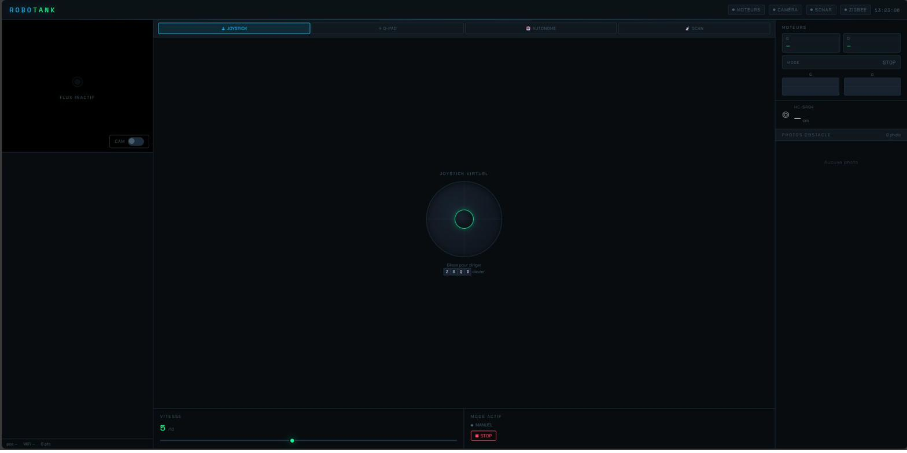

# 🤖 RoboTank

> Robot mobile de surveillance et de cartographie WiFi — Projet SAÉ6.IOM.01, IUT de Blois


<p align="center">
  
</p>

## 📋 Présentation

**RoboTank** est un robot mobile télécommandé conçu dans le cadre du BUT Réseaux & Télécommunications (parcours IoT & Mobilité) à l'IUT de Blois, Université de Tours.

Il combine :
- **Pilotage à distance** via une interface web responsive (joystick, D-PAD, modes autonome et scan)
- **Flux vidéo en direct** depuis une caméra fisheye IR (OV5647)
- **Détection d'obstacles** par capteur ultrasonique HC-SR04
- **Communication Zigbee 3.0** entre la manette physique et le robot
- **Cartographie WiFi** (mesure RSSI 2.4 GHz) avec odométrie par dead reckoning

## 🏗️ Architecture

```
┌─────────────────────────────────────────────────┐
│                  Interface Web                   │
│          (HTML/CSS/JS — Flask served)            │
└──────────────────────┬──────────────────────────┘
                       │ HTTP / MJPEG
                       ▼
┌─────────────────────────────────────────────────┐
│              Raspberry Pi 4B                     │
│  ┌──────────┐ ┌──────────┐ ┌────────────────┐   │
│  │  Flask    │ │ PiCamera │ │  GPIO Steppers │   │
│  │  Server   │ │  Stream  │ │  (28BYJ-48 x2) │  │
│  └──────────┘ └──────────┘ └────────────────┘   │
│       │                                          │
│       │ USB Serial (/dev/ttyACM0, /dev/ttyUSB0)  │
└───────┼──────────────────────────────────────────┘
        │
  ┌─────┴──────┐
  ▼            ▼
┌──────┐  ┌──────────────────┐
│ XIAO │  │ ESP32 + HC-SR04  │
│ ESP32│  │ + OLED Display   │
│ C6   │  └──────────────────┘
│Zigbee│
└──┬───┘
   │ Zigbee 3.0 (IEEE 802.15.4)
   ▼
┌────────────────┐
│ Manette XIAO   │
│ ESP32-C6 #2    │
│ (Joystick +    │
│  Boutons)      │
└────────────────┘
```

## 🔧 Matériel

| Composant | Modèle | Rôle |
|-----------|--------|------|
| Ordinateur de bord | Raspberry Pi 4B (4 Go) | Serveur Flask, contrôle moteurs, stream vidéo |
| Microcontrôleurs | XIAO ESP32-C6 × 2 | Communication Zigbee (manette ↔ robot) |
| Moteurs | 28BYJ-48 + ULN2003 × 2 | Propulsion différentielle |
| Caméra | OV5647 Fisheye IR | Flux vidéo MJPEG |
| Capteur distance | HC-SR04 | Détection d'obstacles |
| Afficheur | OLED SSD1306 | Infos distance & état |
| Alimentation | Batterie USB 5000 mAh | Alimentation autonome |
| Châssis | Impression 3D (PLA) | Conçu sur Shapr3D, imprimé sur Bambu Lab P1S |

## 📂 Structure du projet

```
robotank/
├── src/
│   └── server.py              # Serveur Flask principal (multithreadé)
├── web/
│   └── index.html             # Interface de contrôle responsive
├── docs/
│   └── latex/
│       └── Cahier_des_charges_RoboTank.tex  # Cahier des charges complet
├── images/
│   ├── robot/                 # Photos du robot assemblé
│   ├── interface/             # Captures de l'interface web
│   ├── 3d-design/             # Rendus Shapr3D du châssis
│   └── hardware/              # Photos des composants
├── .gitignore
├── LICENSE
└── README.md
```

## 🚀 Installation & Démarrage

### Prérequis

- Raspberry Pi 4 avec Raspberry Pi OS Bookworm
- Python 3.11+
- Caméra CSI connectée et activée

### Installation des dépendances

```bash
sudo apt update
sudo apt install python3-flask python3-serial python3-picamera2 python3-rpi.gpio
```

### Lancement

```bash
cd src/
python3 server.py
```

L'interface est accessible sur `http://<IP_DU_PI>:5000`

## 🎮 Modes de contrôle

| Mode | Description |
|------|-------------|
| **Joystick** | Contrôle analogique tactile |
| **D-PAD** | Contrôle directionnel classique |
| **Autonome** | Navigation avec évitement d'obstacles |
| **Scan WiFi** | Cartographie RSSI automatique |
| **Manette Zigbee** | Contrôle via manette physique XIAO ESP32-C6 |

## 📸 Galerie

<p align="center">
  
  
</p>

## 👨‍🎓 Auteur

**Léo-Paul** — BUT Réseaux & Télécommunications, parcours IoT & Mobilité  
IUT de Blois — Université de Tours  
Superviseur : M. Jeanneret

## 📄 Licence

Ce projet est sous licence MIT — voir le fichier [LICENSE](LICENSE) pour plus de détails.
